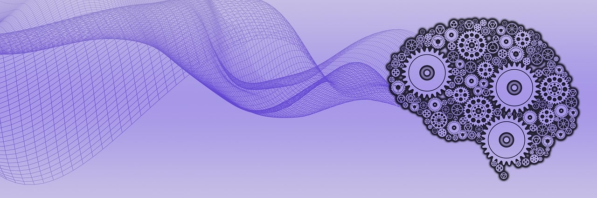

# Nessi / Percorsi nelle Scienze Umane

### Un manuale di Scienze Umane ad accesso aperto

Pete Linforth / [Pixabay](https://pixabay.com/it//?utm_source=link-attribution&utm_medium=referral&utm_campaign=image&utm_content=5274019)

    

> Lo studio adatto all'uomo è quello dei suoi rapporti." Jean-Jacques Rousseau

_Nessi_ è il cantiere di un manuale di Scienze Umane ad accesso aperto per il Liceo delle Scienze Umane, curato da [Antonio Vigilante](autore.md).

[Presentazione](presentazione.md)

## Aree

Antropologia / [Pedagogia](pedagogia/index.md) / [Psicologia](psicologia/index.md) / Sociologia  

## In evidenza

[Maria Montessori](psicologia/montessori.md)

 

