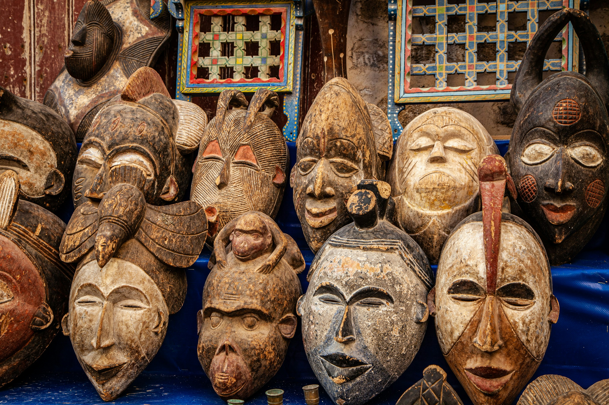

<link rel="stylesheet" href="../assets/style.css">

<button class="button yellow">Antropologia culturale</button> 

[@ Mario La Pergola](https://unsplash.com/it/foto/maschera-di-legno-marrone-su-tessuto-blu-U6qZ22_YgoI)

## Introduzione all'antropologia culturale
[1. La diversità umana](introduzione.md#la-diversità-umana)  
[2. Una domanda antica](introduzione.md#una-domanda-antica)  
[3. Una disciplina moderna](introduzione.md#una-disciplina-moderna)  
[4. La cultura](introduzione.md#la-cultura)  
[5. Relativismo culturale e etnocentrismo](introduzione.md#relativismo-culturale-e-etnocentrismo)  
[6. Branche dell'antropologia](introduzione.md#branche-dellantropologia)  
[7. I metodi](introduzione.md#i-metodi)  
[8. Cosa fa l'antropologo oggi](introduzione.md#cosa-fa-lantropologo-oggi)  
