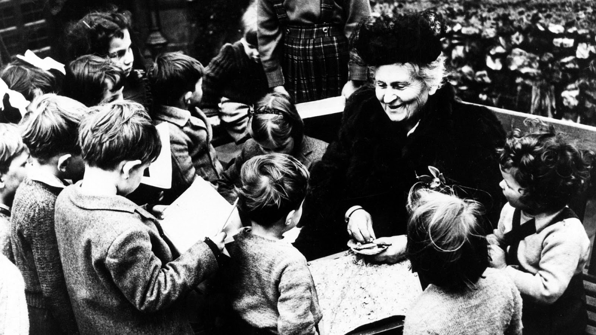

# Maria Montessori

## La vita

Maria Montessori nasce a Chiaravalle, nelle Marche, nel 1870. Cinque anni dopo si trasferisce con la famiglia a Roma, dove frequenta il Regio Istituto Tecnico “Leonardo Da Vinci”, ottenendo il diploma nel 1890. In contrasto con il padre e con gran parte dell’opinione pubblica dell’epoca, che considerava gli studi tecnico-scientifici inadatti alle donne, decide di iscriversi al corso di laurea in medicina dell’Università “La Sapienza”, dove si laurea nel 1896, prima donna italiana laureata in medicina. Lo stesso anno è a Berlin

Nel 1898 dalla relazione con un assistente di psichiatria, Giuseppe Montesano, nasce il figlio Mario; la coppia decide di non sposarsi ed il bambino viene affidato ad una famiglia che vive in campagna. Tornerà a vivere con la madre nel 1912.

Nel 1899 è presente a Londra, su invito del ministro Baccelli, per rappresentare l’Italia all’International Council of Woman. Dopo aver conseguito una seconda laurea in filosofia, viene nominata docente di igiene e di antropologia presso il Magistero di Roma.

Nel 1906 si impegna per la concessione alla donne del diritto di voto, firmando un proclama affisso in diverse città italiane e facendo domanda di iscrizione alle liste elettorali. come è noto, in Italia le donne acquisiranno il diritto al voto solo dopo la caduta del fascismo, nel 1946.

Il 6 gennaio 1907 inaugura a Roma, nel popolare quartiere San Lorenzo, la prima **Casa dei bambini**, seguita da una seconda ad aprile, sempre nello stesso quartiere, mentre ad ottobre apre una Casa nel quartiere Umanitaria a Milano. In un volume intitolato _Il metodo della pedagogia scientifica_ (1909), che avrà grandissimo successo anche all’estero, mette a punto quello che da allora si chiamerà Metodo Montessori. Per diffonerlo, nasce nel 1924 l’Opera Nazionale Montessori.

Il rapporto col fascismo, buono all’inizio, si deteriora inevitabilmente, anche in seguito alle critiche fatte da Giuseppe Lombardo Radice, che sostiene la superiorità e maggiore “italianità” della pedagogia delle sorelle Agazzi e la scarsa originalità di quella di Montessori. Nel 1934 si arriva alla chiusura delle scuole Montessori da parte del regime; lo stesso anno Montessori si dimette dall’Opera Nazionale e in compagnia del figlio viaggia all’estero: prima in Spagna, poi in Inghilterra, infine in India, dove approfondisce i rapporti con la 👉 **Società Teosofica**, cui si era iscritta già nel 1899. In una serie di opere approfondisce il significato pedagogico e psicologico del suo metodo: _Il segreto dell’infanzia_ (1936), _La scoperta del bambino _(1948), _Educazione e pace_ (1949),_ La mente del bambino_ (1949) Muore nel 1952 a Noodwyk, in Olanda.

>👉 La **teosofia** è una dottrina elaborata a fine Ottocento dalla mistica russa Helena Petrovna Blavatsky e caratterizzata dalla ripresa di motivi spirituali provenienti da diverse religioni, in particolare orientali (prime fra tutte il buddhismo), completati da ideali umanitari propri del tempo: la fratellanza, l'emancipazione, la tolleranza. Blavatsky, che era una medium, sosteneva di aver ricevuto le verità fondamentali enunciate nei suoi libri da alcune entità spirituali con le quali era in grado di entrare in contatto. La teosofia ha esercitato una notevole influenza su diversi settori della vita culturale tra la fine dell'Ottocento ed i primi decenni del Novecento.

## L’educazione dei bambini frenastenici

La pedagogia di Montessori ha in origine una impostazione rigorosamente scientifica e positivistica, cui si affiancherà con gli anni una più ampia visione filosofica, etica e perfino religiosa, cui non sarà estranea l’influenza della teosofia. Come abbiamo visto, al Congresso Pedagogico del 1898 Montessori pone il problema dell’educazione dei bambini con deficit intellettivi, che allora si definivano frenastenici. Convinta della possibilità di ottenere risultati notevoli con questi bambini attraverso una educazione guidata da rigorosi principi scientifici, Montessori visita gli istituti all’avanguardia in Inghilterra ed in Francia. Viene così a conoscenza dell’opera dei medici francesi Jean Marc Gaspard Itard e Édouard Séguin, che considererà i suoi maestri. Il primo era noto per il caso di 👉 **Victor dell’Aveyron**, un ragazzo cresciuto in una foresta ed in tutto e per tutto simile alle bestie, che Itard aveva cercato di rieducare. Séguin, allievo di Itard, aveva elaborato un metodo per l’educazione dei bambini frenastenici che cercava di riattivare in loro gradualmente l’intelligenza stimolando i sensi e la muscolatura con esercizi e materiali adatti. Questa gradualità si ritrova anche nelle lezioni tenuta da Montesori alla Scuola Magistrale Ortofrenica, pubblicate ne _L’autoeducazione nelle scuole elementari_ (1919).

Prima di educare un bambino frenastetico bisogna occuparsi del suo corpo, ristabilire delle condizioni di benessere e stimolare i sensi. Con dei bagni freddi o caldi e massaggi si svilupperà la sensibilità, con una dieta attenta e regolata si eviteranno i disturbi intestinali, quindi con una serie di esercizi appositi si stimolerà prima la muscolatura e poi i diversi sensi. A questo punto è possibile passare all’educazione intellettuale, cominciando dall’apprendimento della lettura, che avverrà attraverso lettere in legno che il bambino dovrà toccare, abituandosi al gesto della scrittura; si passa quindi a quelle che Montessori chiama “lezioni oggettive”, nelle quali si mostrerà in modo breve ed essenziale, ma ripetuto nel tempo e con diverse prospettive, un oggetto vicino all’esperienza del bambino. Momento culminante è l’educazione morale, intesa come educazione della volontà e del sentimento. In questo periodo Montessori ritiene indispensabile che l’educatore eserciti la propria autorità sul bambino e lo costringa all’ubbidienza attraverso il comando. “Il maestro che comanda - scrive - è una volontà che s’impone al bambino deficiente, il quale manca di volontà; e si sostituisce alla sua o spingendolo all’azione o inibendo i suoi impulsi”. Per essere efficace il maestro deve fare attenzione a non comandare ciò che non può ottenere, e deve curare la voce, il gesto e la mimica.

>👉 Il caso del **ragazzo selvaggio dell'Aveyron** fece molto scalpore in Francia all'inizio dell'Ottocento. Catturato nel 1800 in un villaggio, era nudo ed aveva comportamenti animaleschi. Fu portato a Parigi in un istituto per sordomuti, dove si prese cura di lui il dottor Jean Marc Itard, che riuscì ad averne l'affidamento allo scopo di rieducarlo. Al caso è dedicato il film di François Truffaut _Il ragazzo selvaggio_ (1970).

## La liberazione del bambino

A spingere Montessori verso lo studio dell’educazione dei bambini frenastenici c’è una preoccupazione umanitaria: quella di lavorare per l’emancipazione, la crescita, il miglioramento di soggetti che sono al margine dell’umanità, relegati tradizionalmente nei manicomi e considerati irrecuperabili. C’è una continuità tra la sua lotta politico-culturale in favore delle donne e la sua ricerca scientifica nel campo dell’educazione dei bambini frenastenici. In entrambi i casi si tratta di un lavoro per la liberazione e l’integrazione nella società di soggetti esclusi. Ma sono soltanto le donne ed i bambini frenastenici in questa condizione di esclusione? Ben presto Montessori si rende conto che il soggetto escluso e marginalizzato per eccellenza nella società è il bambino; non solo quello frenastenico, ma anche quello in salute fisica e mentale. La società ha fatto progressi enormi nel riconoscimento dei diritti personali degli adulti, ma non si può dire lo stesso dei diritti del bambino. In nome della stessa educazione si sono compiute e si compiono violenze sui bambini. È normale rivolgersi al bambino con durezza e sottoporlo a castighi; se è vero che le punizioni corporali sono sempre meno accettate, è anche vero che spesso i genitori si credono in dovere di dare ai figli qualche schiaffo.

>Eppure – scrive Montessori nel _Segreto dell’infanzia_ – si sono aboliti i castighi corporali per gli adulti, perché avviliscono la dignità umana e sono una vergogna sociale. Ma esiste villania maggiore dell’offendere e battere un bambino? È evidente che la coscienza dell’umanità è sommersa in un sonno profondo.

Luogo di violenza per il bambino è anche la scuola. Le scuole, i luoghi in cui si compie il lavoro delicatissimo e cruciale dell’educazione, sono edifici squallidi, pensati e progettati dal punto di vista dell’adulto, sì che un bambino vi si perde. Con indosso una uniforme, il bambino dovrà sedere ad un banco per ore ed ore, immobile, in potere della maestra, costretta a sottomettersi all’insegnamento, più che ad apprendere realmente. Tale è la sua condizione, che Montessori lo paragona al Cristo: il banco è come la croce, che costringe a subire immobile il supplizio. Ma come il Cristo il bambino risorge: “Come ha detto Emerson, il bambino è l’eterno Messia, che sempre ritorna fra gli uomini decaduti, per condurli nel regno dei Cieli”. Questo paragone non sembri eccessivo. Per Montessori è nel bambino che risiede ogni possibilità di cambiamento e di riscatto per l’umanità.

L’unica possibilità di avere una umanità felice, libera dal flagello della violenza e della guerra, risiede nel bambino, nella sua possibilità di prendere una direzione diversa rispetto a quella che è stata presa dai suoi genitori e dai suoi insegnanti. Come è evidente, l’educazione non deve dunque replicare nel bambino l’adulto, riprodurre il mondo esistente con i suoi limiti, ma deve essere occasione per una trasformazione e liberazione radicale.

Perché ciò sia possibile, occorre da un lato il senso profondo del rispetto verso il bambino e la coscienza dei suoi diritti, e dall’altro lo sguardo scientifico, che consente di liberare l’infanzia dal peso di superstizioni, errate credenze, suggestioni apparentemente rispettose dell’infanzia, e che in realtà l’alienano. Quando non è costretto a stare immobile in un banco, il bambino viene fatto vivere in un mondo di balocchi, di fantasie, di fiabe, di immaginazione. Si ritiene che questo sia il mondo proprio del bambino. Nulla di più falso, per Montessori. Il bambino, quando non si trova in condizioni di alienazione, non si perde in fantasie, ma si concentra e lavora in modo disciplinato ed attento. Affinché emerga questo aspetto dell’infanzia, occorre che al bambino venga offerto un ambiente adatto, che non abbia nulla della violenza strutturale delle scuole tradizionali e gli dia la possibilità di fare esperienze creative autonome.

## La Casa dei bambini

Le prime due Case dei bambini nascono a Roma in un quartiere, il San Lorenzo, caratterizzato da degrado abitativo e da una forte criminalità, in cui molti bambini crescevano per strada. La scelta non è casuale, ma risponde all’intento di contribuire al risanamento del quartiere, avviato dall’Istituto Romano di Beni Stabili con il restauro delle abitazioni. Per affrontare il degrado sociale si pensa di istituire degli asili infantili, affidandone l’organizzazione a Montessori. La proposta le consente di mettere in pratica le sue idee pedagogiche, realizzando anche i suoi ideali umanitari e di liberazione femminile.

La Casa dei bambini è pensata come una struttura educativa al servizio del cambiamento del territorio. La direttrice della Casa ha l’obbligo di risiedere nel quartiere e di mettere a disposizione della sua gente la sua cultura e le sue competenze; è una sorta di operatrice per lo sviluppo comunitario. Il regolamento della Casa impone ai genitori alcuni obblighi: dovranno portare i figli puliti e collaborare con le maestre nel loro lavoro educativo. Così le Case avviano la trasformazione delle famiglie, tolgono i bambini dalle strade, offrono alle donne la possibilità di affrancarsi dalle incombenze legate alla cura dei figli e di dedicarsi a sé stesse. C’è, dietro questa impostazione, la consapevolezza che non è sufficiente studiare scientificamente il bambino per giungere ad una educazione efficace; occorre considerare anche l’ambiente familiare e sociale in cui cresce.

Come afferma nel discorso inaugurale della seconda Casa dei bambini, “invano cercherà la pedagogia scientifica di migliorare le nuove generazioni se non giunge ad influire anche sull’ambiente ove le nuove generazioni sorgono e crescono”. Tuttavia questa esigenza di apertura all’ambiente sociale, realmente essenziale, non ha trovato in Montessori un adeguato sviluppo, e resta una affermazione di principio, più che una direzione d’azione. Il bambino, più che partecipare attivamente alla vita sociale del quartiere, resta legato al suo materiale, impegnato nel suo processo di autoeducazione. Dal punto di vista strutturale, la Casa dei bambini è l’esatto contrario delle scuole. Se queste, come abbiamo visto, sono pensate e progettate dal punto di vista dell’adulto, la Casa dei bambini, ed è questa una grande novità, è realmente a misura di bambi**no**: le sedie, i tavoli, tutto l’arredamento è proporzionato alle misure dei bambini. I tavolini, oltre che piccoli, sono leggeri, in modo che i bambini stessi possano trasportarli. Le credenze sono ad altezza di bambino, e così anche il lavabo. Alle pareti ci sono dei piccoli quadri ed una grande riproduzione della Madonna della Seggiola di Raffaello, che per Montessori è l’emblema delle Case dei bambini. Questa scelta innovativa riguardante il setting scolastico esprime concretamente la centralità del bambino nell’educazione. L’altra innovazione della Casa è il materiale.

## Il materiale e gli esercizi

La scuola tradizionale ha il suo fondamento nella parola dell’insegnante, che spiega alla classe gli argomenti che di volta in volta intende proporre agli studenti. La lezione può far ricorso anche a dei materiali di supporto, il cosiddetto materiale oggettivo, che però è ancora legato alle esigenze dell’insegnante, più che a quelle degli alunni. Gli oggetti fanno riferimento agli argomenti da spiegare, e non hanno alcun rapporto con le esigenze psichiche dei bambini. Al contrario, il materiale montessoriano nasce dalla ricerca scientifica sullo sviluppo sensoriale ed intellettuale dei bambini, ed è progettato affinché i bambini possano usarlo da soli, sviluppando attraverso l’esercizio le proprie facoltà e al tempo stesso riflettendo sulle proprie strategie cognitive. Esso, afferma Montessori, è per il bambino “come una scala che di grado in grado lo aiuta a salire”.

Ogni materiale è adatto ad una determinata fase di sviluppo, ed al tempo stesso aiuta il bambino a passare alla fase successiva. Il bambino non dipende più dalla voce dalla maestra, non è più il destinatario passivo della sua lezione, ma costruisce da sé i proprio apprendimenti, conquistando il senso dell’autonomia ed acquisendo fiducia in sé stesso. Il materiale montessoriano nasce da una lunga sperimentazione e da un progressivo raffinamento, a partire dal materiale usato da Itard e Séguin nell’educazione dei bambini frenastenici.

Lo scopo del materiale è quello di avviare l’educazione dei sensi mettendo ordine nel caos delle impressioni che il bambino riceve normalmente, ed intervenendo anche tempestivamente per correggere eventuali disfunzioni. Solo questo lavoro preliminare sui sensi per Montessori consentirà poi in modo naturale lo sviluppo dell’intelligenza. Il materiale non è in alcun modo imposto al bambino, ma suscita il suo immediato interesse, poiché risponde ad un suo bisogno funzionale. Per questo il bambino nella Casa è libero di scegliere il materiale che preferisce, che sarà anche quello più adatto ai suoi bisogni di crescita. La maestra vigilerà soltanto sul suo uso corretto. Gli oggetti che costituiscono il materiale sono ordinati secondo una specifica qualità fisica e sensoriale: vi sono oggetti che riguardano la forma, altri il colore, altri ancora il suono, il peso, la ruvidezza, e così via.

Il materiale isola una sola qualità e la presenta in forma graduale, andando da un minimo ad un massimo, in modo che il bambino possa affinare la propria capacità di percezione cogliendo la differenza di intensità degli stimoli sensoriali. Per far acquisire al bambino la capacità di riconoscere i colori si useranno così delle tavolette intorno alle quali sono avvolti dei fili di seta colorati con nove tinte diverse, ognuna delle quali presentata in sette diverse gradazioni, per un totale di 63 tavolette. Con questo materiale è possibile organizzare diversi giochi, chiamando i bambini a disporre le tavolette secondo il colore e l’intensità della gradazione. Per educare il tatto si usano tavolette ricoperte di carta liscia o vetrata e smerigliata, anche qui con diverse gradazioni; i bambini le sfiorano con le dita e gli occhi chiusi, riconoscendo le differenze. Per educare la percezione dei suoni si fa ricorso a scatole cilindriche che contengono oggetti che fanno rumori diversi (sabbia, pietre ecc.) ed a campane che emettono suoni corrispondenti alle sette note. E così via.

Gli esercizi con i materiali si svolgono secondo tre momenti. Al principio il bambino deve riconoscere l’identità, mettendo insieme oggetti simili; in seguito è portato a riconoscere i contrasti, individuando gli estremi di ogni gradazione; infine dovrà saper distinguere le somiglianze, ordinando il materiale secondo la gradazione. Il materiale è costruito con forme attraenti e colori vivaci, in modo da attirare spontaneamente il bambino; inoltre è fatto per stimolare l’attività del bambino, per essere cioè spostato, manipolato eccetera. Molti oggetti poi sono autocorrettivi, ossia sono costruiti in modo tale che il bambino può rendersi conto immediatamente dell’errore. Ciò fa sì che il bambino, mentre usa il materiale, possa riflettere sui suoi errori ed imparare da essi, giungendo autonomamente alla soluzione. Oltre agli esercizi con il materiale nella Casa vi sono esercizi di vita pratica, che riguardano il mantenimento dell’ordine e della pulizia dell’ambiente e della persona. Il bambino dovrà così imparare a muovere silenziosamente le sedie, a trasportare gli oggetti, a camminare in punta di piedi, a spolverare, a versare acqua nei recipienti, a vestirsi e lavarsi da sé, a mangiare usando le posate, ad apparecchiare la tavola, a marciare ritmicamente eccetera.

## La maestra

Come già accennato, il ruolo della maestra nella Casa è principalmente quello di vigilare sull’uso corretto del materiale da parte dei bambini. Si tratta di un ruolo ben diverso da quello tradizionale. L’educazione nella Casa è sostanzialmente autoeducazione: i bambini si educano da sé lavorando con il materiale, non dipendono dalla maestra e dalle sue lezioni. Nella scuola tradizionale l’iniziativa spetta all’insegnante; ora invece l’insegnante è chiamata a farsi da parte, ed a lasciare che il bambino faccia da sé. Scrive Montessori:

Gli oggetti e non l’insegnamento della maestra sono la cosa principale: ed essendo il bambino che li usa, egli, il bambino, è l’entità attiva e non la maestra”. Il suo compito è di fare da collegamento tra il bambino ed il materiale, che naturalmente dovrà conoscere bene, non in modo esteriore, ma per averlo adoperato lei stessa a lungo, sperimentandone in prima persona le caratteristiche e le difficoltà. Presenterà il materiale ai bambini mostrando loro l’uso corretto e vigilerà sul suo uso corretto. Nel caso in cui qualche bambino ne faccia un uso errato, la maestra deve intervenire: in modo dolce, se il bambino è tale, in modo più energico ed autorevole, se il bambino mostra una certa disposizione al disordine. L’ordine, l’armonia, l’operosità silenziosa caratterizzano l’atmosfera dalle Casa dei bambini. Per custodire questa atmosfera, la maestra deve vigilare anche affinché “il bambino che sta assorto nel suo lavoro non sia disturbato da nessun compagno.

Come è stato osservato da non pochi critici, questo che a Montessori appare come un disturbo può essere nulla più che l’espressione di una esigenza di socialità, che nella Casa viene sacrificata allo sviluppo sensoriale attraverso il lavoro individuale. Del resto, nella Casa dei bambini è raro che si verifichino problemi disciplinari. Nelle classi, affollate anche da cinquanta bambini, vige l’ordine più assoluto. Un risultato che non è ottenuto con rimproveri e comandi, mezzi che per Montessori sono privi di utilità per raggiungere lo scopo, ma semplicemente con il lavoro. I bambini non si abbandonano al disordine perché sono concentrati nelle loro attività, intenti al lavoro. se un bambino esprime irrequietezza muscolare, non serve a molto intimargli di star fermo, poiché quel suo comportamento è espressione di un bisogno di coordinamento motorio che dev’essere soddisfatto. Bisognerà cercare dunque gli esercizi adatti a rendere armoniosi i suoi movimenti, raggiungendo al contempo l’obiettivo di ristabilire la disciplina turbata dal suo comportamento.

## Lo sviluppo infantile

Il profondo ripensamento del ruolo della maestra che abbiamo appena visto è in Montessori la conseguenza della sua concezione scientifica dello sviluppo infantile. Una convinzione diffusa vuole che il bambino venga costruito, plasmato dall’adulto, che dirige la sua evoluzione psichica. Per Montessori non è solo un errore: è una forma di arroganza, con la quale l’adulto si attribuisce un potere quasi divino sul bambino. E’ una convinzione pericolosa, perché può ostacolare il naturale processo di sviluppo psichico e personale, che Montessori con un termine che ha qualcosa di religioso, chiama incarnazione. Considerare il bambino come un essere che si incarna vuol dire scorgere in lui un progetto originario, una serie di inclinazioni che esistono già alla nascita, e che si svilupperanno con il tempo. Gli animali riescono poco tempo dopo la nascita a raggiungere l’autonomia, mentre i neonati restano a lungo non autosufficienti. Ma l’animale non fa che replicare la sua specie, mentre l’essere umano è un individuo irripetibile. Si potrebbe dire, scrive Montessori nel Segreto dell’infanzia, che l’animale è un oggetto fabbricato in serie, mentre l’uomo è come un oggetto lavorato a mano: “ognuno è diverso dall’altro, ognuno ha un proprio spirito creatore, che ne fa un’opera d’arte della natura”.

Questo spirito creatore, questa molla interiore che, attraverso un processo che durerà anni, creerà l’individuo unico ed irripetibile, è chiamato da Montessori embrione spirituale. E’ una energia misteriosa e creativa, che presiede all’opera della autocreazione del bambino; una forza che ha bisogno di un ambiente positivo per compiere la sua opera, esattamente come l’embrione fisico ha bisogno dell’ambiente del ventre materno per svilupparsi. Lo sviluppo è l’impresa faticosa con la quale l’embrione spirituale costruisce l’individuo assimilando progressivamente l’ambiente. Sapere questo, vuol dire guardare il bambino con occhi nuovi, imparare un nuovo rispetto: “Quel corpicciuolo tenero e grazioso che adoriamo ricolmandolo di cure soltanto fisiche e che è quasi un giocattolo nelle nostre mani, assume un altro aspetto e incute riverenza, ‘Multa debetur puero reverentia’”. La massima di Quintiliano acquista ora un nuovo valore: il bambino incute rispetto per la grandiosità della sua impresa, perché costruendo sé stesso il bambino costruisce al contempo anche l’umanità.

Non è vero, afferma Montessori, che l’uomo è il padre del bambino. E’ vero il contrario. “Bisognerebbe dire: l’uomo è stato costruito dal bambino: costui è il padre dell’uomo”. Il bambino alla nascita non è guidato da schemi di comportamento innati, ma non è nemmeno totalmente in balia dell’ambiente. Piuttosto, ha la capacità di acquisire dall’ambiente le informazioni che sono necessarie per la sua crescita. Questa capacità è per Montessori il fatto fondamentale per comprendere lo sviluppo psichico nei primi tre anni di vita. La mente del bambino, a differenza di quella dell’adulto (che per imparare deve far ricorso alla volontà ed all’attenzione) ha la capacità di imparare acquisendo in modo inconscio dall’ambiente ciò di cui ha bisogno. Montessori la chiama, per questo, mente assorbente, precisando che il modo in cui la mente assorbe è diverso da quello della spugna, che assorbe l’acqua senza riuscire poi a trattenerla. La mente del bambino assorbe informazioni che resteranno per tutta la vita e costituiscono la base del suo carattere futuro.

Questo assorbimento non avviene in modo casuale, ma segue delle leggi ben precise ed alcuni periodi sensitivi. Esistono nel bambino delle energie che gli consentono di assorbire in modo inconscio dall’ambiente le informazioni di cui ha bisogno, e che Montessori chiama nebule. Quando una nebula si attiva, il bambino è sensibile in modo particolare ad alcuni stimoli, quelli che in quel momento sono importanti per la sua crescita. Quando ad esempio giunge il momento della nebula del linguaggio, il bambino riesce improvvisamente a distinguere il linguaggio umano dagli altri suoni e rumori, e se qualcuno gli parla prova un piacere che manifesta con il sorriso. Emerge con chiarezza l’importanza assoluta dell’ambiente per lo sviluppo psichico del bambino. Se, quando è attiva una particolare nebula, il bambino non riceve dall’ambiente gli stimoli necessari, accade un ritardo nello sviluppo che può essere difficile colmare in seguito. Fino all’età di tre anni dunque l’educazione coincide con la vita stessa. In questa fase psico-embrionale il bambino assorbe inconsciamente dall’ambiente ciò di cui ha bisogno. Non occorre che qualcuno ad esempio gli insegni a parlare: impara da sé.

Da adulti non ricorderemo le cose avvenute in questa fase, perché la personalità non era ancora completa. Le cose cambiano verso i tre anni d’età con l’emergere della coscienza. Nella prima fase il bambino ha creato le funzioni fondamentali; ora queste vengono sviluppate e condotte all’unità. Se prima si limitava ad assorbire l’ambiente circostante, anche se in modo creativo, ora ha una sua volontà, e dunque agisce consapevolmente sull’ambiente. Adesso il bambino mostra una naturale attitudine alla astrazione ed a seguire l’ordine e l’esattezza dei procedimenti logici: sviluppa quella che Montessori chiama mente matematica. Le difficoltà che molti bambini hanno con la matematica sono il segno di un cattivo procedimento educativo. Se vengono messi a contatto con del materiale adatto, come quello montessoriano, e si assegnano loro dei compiti che richiedono precisione ed esattezza, i bambini mostrano una spontanea attrattiva per la matematica e lavorano con interesse ed attenzione.

## La normalizzazione

Uno dei problemi eterni della pedagogia è quello del rapporto tra autorità e libertà. Da una parte v’è chi pensa che il bambino, lasciato a sé, si abbandonerebbe alle proprie tendenze negative, per cui è necessario l’intervento correttivo dell’adulto; dall’altra si obietta che è l’autorità a deviare il naturale svolgimento delle facoltà del bambino, che solo nella libertà possono svilupparsi in modo armonico. Dal punto di vista di Montessori questa è una falsa alternativa. Gli educatori autoritari impongono un ordine ed una disciplina che sono inevitabilmente falsi, perché legati solo alla paura ed all’imposizione dell’adulto. Quando questi limiti vengono eliminati da un approccio libertario si ha, nota Montessori, “uno scatenamento disordinato di impulsi non più controllati perché erano stati prima controllati soltanto dalla volontà degli adulti”. Questa non è vera libertà, e non favorisce la crescita del bambino.

Nella Casa dei bambini avviene qualcosa di diverso. Regna una disciplina che tuttavia non ha alcun bisogno del ricorso all’autorità. Come è possibile? Grazie al lavoro. I bambini sono chiassosi, disordinati, distratti, capricciosi, pigri se non hanno qualcosa da fare; qualcosa, s’intende, che sia importante per loro. Nella Casa trovano molte attività interessanti da fare e si concentrano facilmente nel lavoro. Il bambino viene così disciplinato non dall’intervento autoritario della maestra, ma dall’ambiente stesso, che non gli consente di distrarsi perché ad ogni passo esige la sua attenzione. Montessori chiama normalizzazione questa riconquista delle sue qualità positive da parte del bambino. Il bambino disciplinato, che lavora e si concentra (e si apre all’altro, diventando socievole ed altruista), è null’altro che il bambino vero, il bambino normale. Deviato è invece il bambino che le tendenze disgregatrici e diseducative dovute all’ambiente esterno ed all’intervento dell’adulto costringono ad una fuga nella fantasia. E’ un bambino spezzato, perché non gli si consente di incarnare l’intelligenza nell’azione, esprimendosi attraverso il movimento e facendo esperienze concrete; non gli resta dunque che la via dell’immaginazione. La Casa dei bambini si configura dunque come un luogo di guarigione. “Si direbbe - conclude Montessori ne La mente del bambino - che i bambini fanno esercizi di vita spirituale, avendo trovato una via di perfezionamento e di ascesa.”

## Una pedagogia per la pace

Nella sua lunga vita Maria Montessori ha assistito alle due guerre mondiali, all’affermarsi dei nazionalismi, delle persecuzioni razziali, dell’odio in tutte le sue forme. Una delle preoccupazioni costanti della sua ricerca è quella della pace; ed è significativo che la sua ultima opera, La mente del bambino, si chiuda con una riflessione sull’amore. Per quanto sembri essere stato cacciato via dal mondo, l’amore è in realtà una grande energia cosmica, anzi è l’universo stesso, il principio che guida il mondo inanimato e quello animato, spingendo costantemente verso l’armonia e l’unità. Anche quando i cuori sembrano essersi inariditi, c’è un modo semplice ed infallibile per riscoprire l’amore: guardare un bambino.

Ovunque il bambino suscita immediatamente amore, dolcezza, tenerezza. “Il bambino - scrive - è una sorgente d’amore; quando lo si tocca, si tocca l’amore”. Se si cerca poi di comprendere l’amore, si scoprono affinità significative con la mente assorbente. L’amore è la capacità di accettare senza giudicare, di comprendere, di armonizzare. Non è forse questo che fa il bambino? Alla fine del suo percorso, Montessori mostra così che gli adulti, che hanno la pretesa di educare i bambini, dovranno imparare da loro ciò che è assolutamente indispensabile per la sopravvivenza della specie. “Lo studio dell’amore e la sua utilizzazione ci porteranno alla sorgente dalla quale esso zampilla: il Bambino. Questa è la strada che l’uomo dovrà percorrere nel suo affanno e nei suoi travagli, se egli, come aspira, vuole raggiungere la salvezza e la unione dell’umanità”.

## Bibliografia

Tutte le opere di Maria Montessori sono disponibili in edizioni recenti presso l’editore Garzanti di Milano. Moltissimi sono anche gli studi su Montessori. Per una introduzione si può leggere il libro della sua allieva Grazia Honegger Fresco: _Maria Montessori. Una storia attuale_ (L’ancora del Mediterraneo, Napoli 2008). Si può poi approfondire con Giacomo Cives, _Maria Montessori. Pedagogista complessa_ (ETS, Pisa 2001), Clara Torna, _La pedagogia di Maria Montessori tra teoria e azione_ (FrancoAngeli, Milano 2007) e Raniero Regni, _Infanzia e società in Maria Montessori. Il bambino padre dell’uomo_ (Armando, Roma 2007). Sul femminismo di Maria Montessori è utile il libro di Valeria P. Babini e Luisa Lama _Una donna nuova. Il femminismo scientifico di Maria Montessori_ (FrancoAngeli, Milano 2000).

Testo di Antonio Vigilante. Licenza Creative Commons Attribuzione - Non commerciale - Non opere derivate 3.0 Italia.
